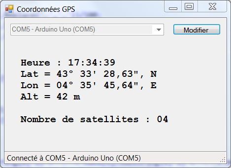

# Module GPS Grove SEN10752P #

## Mise en oeuvre ##

Sa mise en oeuvre s'appuie sur l'utilisation de la libraire SoftwareSerial :

    SoftwareSerial SoftSerial(2, 3);

pin 2 : RX sur arduino a connecté sur TX du module (fil jaune)
pin 3 : TX sur arduino a connecté sur RX du module (fil blanc)

Consulter le wiki du module : [http://wiki.seeed.cc/Grove-GPS/](http://wiki.seeed.cc/Grove-GPS/)

## Traitement des données ##
Le traitement est ici réalisé avec une simple application de démo réalisée avec Visual Studio en C# :

Le contenu d'une trame NMEA est décrit ici : [https://fr.wikipedia.org/wiki/NMEA_0183](https://fr.wikipedia.org/wiki/NMEA_0183)

